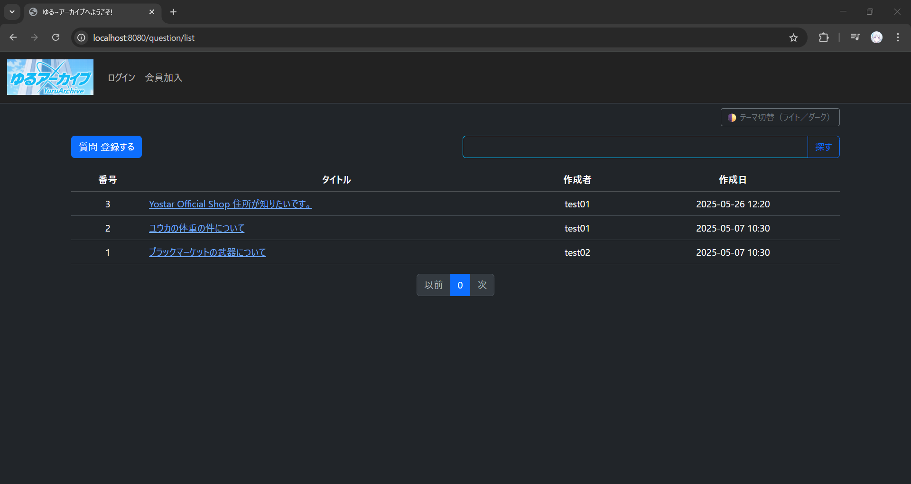
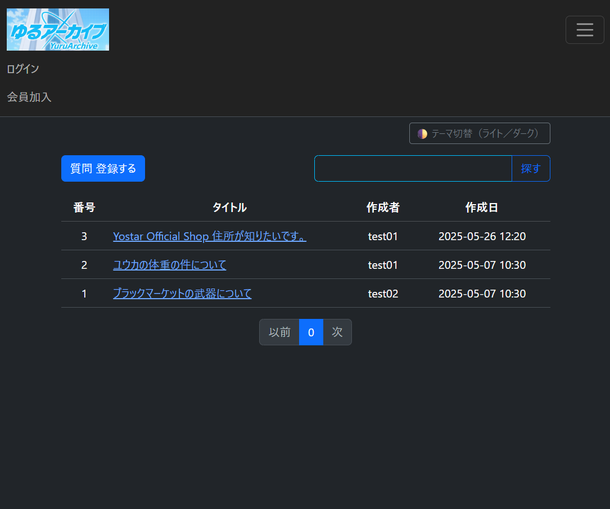

# yuru-archive

## プロジェクト説明
🚀 ゆるアーカイブは、ある週末の夜、  
ふと「質問掲示板ってもっと気軽にできないかな」と思ったことから始まりました。

Spring Boot × PostgreSQLをベースに、  
まだ発展途中ながらも、ログイン・投稿・回答など基本機能を少しずつ組み立てています。

設計から実装まですべて一人でこつこつ進めています。  
「ゆるく、でもちゃんと残る」アーカイブを目指して。

実はこのプロジェクト名には、  
私が日頃楽しんでいるモバイルゲーム「ブルーアーカイブ」からの  
ささやかなインスピレーションも込められています。

**「日常に、小さな奇跡を。」**  
その言葉のように、  
このプロジェクトも、誰かの小さな気づきや発見に繋がればという気持ちで作っています。

🌱 よかったらそっと見守ってください。

## 🖥️ メイン画面（PC・モバイル）
# PCバージョン
 

# モバイルバージョン

📍一部のスマートフォン・タブレット機種によって異なって見えるかもしれないので、ご了承ください。

## 🔧 主な機能一覧

| 🛠 機能 | 💡 概要 |
|--------|--------|
| 質問・回答投稿機能 | 登録済ユーザによるQ&A作成、編集、削除 |
| 添付ファイル | 画像アップロード＋自動サムネイル生成 |
| タグ・カテゴリ機能 | 質問の分類・管理 |
| 投票（いいね）機能 | 回答に対するAjaxベースの評価機能 |
| ダークモード | Bootstrap 5.3 のテーマ切替に対応 |
| 日本住所API | 郵便番号による自動入力（ZipCloud） |

## 技術スタック
- Java 17 / Spring Boot 3.2
- PostgreSQL 16 / H2 Database（テスト用）
- Thymeleaf / Bootstrap 5.3
- Docker / Docker Compose
- Thumbnailator（画像サムネイル）
- 郵便番号API：[ZipCloud](https://zipcloud.ibsnet.co.jp/doc/api)

## 特徴
- 質問・回答の投稿、編集、削除機能
- カテゴリ別の質問管理
- タグ機能
- 日本向け郵便番号APIによる住所自動入力
- 電話番号日本仕様のバリデーション対応
- Dockerを使用したローカル環境構築

## 📂 ファイルアップロード構成
com.yuru.archive.attach
├── controller
├── dto
├── entity
├── repository
└── service

✅ 詳細仕様（アップロード・削除・DB保存・GitHub URL対応など）  
📖 → README下部に詳細あり、または別ファイル参照

## 🔍 開発メモ・技術ノート（詳細）
開発環境の構築やトラブル対応の記録については、以下の文書をご参照ください。

| カテゴリ | ドキュメント |
|----------|--------------|
| Lombok設定（Ubuntu） | [devlog-lombok.md](docs/devlog-lombok.md) |
| PostgreSQLリモート接続 | [devlog-postgres-remote.md](docs/devlog-postgres-remote.md) |
| 添付ファイルの構成と仕様 | [devlog-fileupload.md](docs/devlog-fileupload.md) |
| ダークモード切替の実装 | [devlog-darkmode.md](docs/devlog-darkmode.md) |
|「いいね」機能の不具合対応 | [devlog-like-troubleshoot.md](docs/devlog-like-troubleshoot.md) |
| 日本住所API構成と仕様 | [devlog-Japan Address API.md](docs/devlog-Japan_Address_API.md) |
| spring-security Auth | [devlog-springSecurity.md](docs/devlog-springSecurity.md) |
| Database設計 | [devlog-database.md](docs/devlog-database.md) |
| 時間帯に合わせてログインする時に挨拶出力機能 | [devlog-greeting_Japan.md](docs/greeting_Japan.md) |