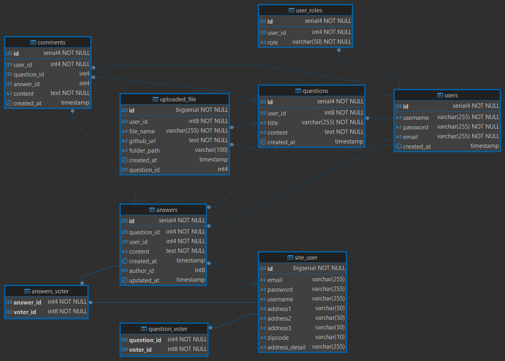

# yuru-archive


SpringBootを利用して、質問掲示板を作りました。

## プロジェクト説明
🚀 ゆるアーカイブは、ある週末の夜、  
ふと「質問掲示板ってもっと気軽にできないかな」と思ったことから始まりました。

Spring Boot × PostgreSQLをベースに、  
まだ発展途中ながらも、ログイン・投稿・回答など基本機能を少しずつ組み立てています。

設計から実装まですべて一人でこつこつ進めています。  
「ゆるく、でもちゃんと残る」アーカイブを目指して。

実はこのプロジェクト名には、  
私が日頃楽しんでいるモバイルゲーム「ブルーアーカイブ」からの  
ささやかなインスピレーションも込められています。

**「日常に、小さな奇跡を。」**  
その言葉のように、  
このプロジェクトも、誰かの小さな気づきや発見に繋がればという気持ちで作っています。

🌱 よかったらそっと見守ってください。


## 技術スタック
- Spring Boot 3.2
- BootStrap 5.3
- Java 17
- PostgreSQL 16
- H2 Database(ロカルテスト用)
- Apache Tomcat 10.1
- Thymeleaf
- Thumbnailator(サムネールを作るために使用しました。)
- Docker / Docker Compose

## 特徴
- 質問・回答の投稿、編集、削除機能
- カテゴリ別の質問管理
- タグ機能
- 日本向け郵便番号APIによる住所自動入力
- 電話番号日本仕様のバリデーション対応
- Dockerを使用したローカル環境構築

## Database設計
本プロジェクトではPostgreSQLを使用しており、以下のようにテーブルを設計しております。

### ERD(修正2版)


### テーブル定義 (SQL)
📎 [ゆるアーカイブ SQL ファイル](sql/ゆるアーカイブQuery.sql)

各テーブルはEntityとDTOの設計を元に作成され、実際のサービス運用を想定しております。


## デモ (開発中です。)

## プログラミング作業中の記録事項

### Ubuntu環境におけるLombok設定手順

このプロジェクトは、WindowsおよびUbuntuの両環境でLombokを使用するために、以下の設定を行いました。

### ✅ 実施内容

- GradleプロジェクトにLombok依存関係を追加
- Ubuntu上で`./gradlew build -x test`を実行して依存関係を取得
- `lombok.jar`を公式サイトよりダウンロードし、Spring Tool Suite（STS）に手動で適用
- Eclipse/STS上でアノテーションプロセッサーを有効化し、Lombokが正しく機能することを確認


## Ubuntu環境におけるLombok設定について

本プロジェクトは、WindowsおよびUbuntuの両環境に対応しています。Ubuntu環境においては、Lombokの導入と設定にいくつかの追加手順が必要となるため、以下にその内容を記載いたします。

### 🛠 実施内容の概要

- GradleベースのプロジェクトにLombokの依存関係を追加
- `./gradlew build -x test` によりテストをスキップしつつ依存関係を取得
- `lombok.jar` を用いて、Spring Tool Suite（STS）への手動設定を実施
- Annotation Processorを有効化し、Lombokアノテーションの認識を確認
- Windows環境でもGit Pull後、設定に問題がないことを確認済み

### 📦 `build.gradle` に追加した依存関係
```groovy
dependencies {
    compileOnly 'org.projectlombok:lombok:1.18.30'
    annotationProcessor 'org.projectlombok:lombok:1.18.30'
}
```

### ⚙ Lombokの導入手順（Ubuntu）
1. 公式サイトより `lombok.jar` をダウンロード  
   → https://projectlombok.org/download
2. ターミナルで以下のコマンドを実行
   ```bash
   java -jar lombok.jar
   ```
3. GUIが起動したら、STSの実行ファイルを指定（例：`/home/vboxuser/sts-4.29.1.RELEASE/SpringToolSuite4`）
4. 「Install/Update」をクリックして設定を反映
5. STSを再起動し、Lombokのアノテーションが正しく機能するか確認

### ✅ 動作確認済み項目
- `@Getter`, `@RequiredArgsConstructor` などのアノテーションにエラーが表示されないこと
- Windows環境で `git pull` 後も同様に正常動作すること
- ビルド時にエラーが発生しないこと（Ubuntu/Windows共に）
---
本手順により、開発環境のOSに依存せず、Lombokを安定的に利用できる状態となりました。

## postgreSQL DatabaseServer remote setting method

✅ PostgreSQL用 5432ポートのWindowsファイアウォール開放手順（日本語版）<br>
1️⃣ コントロールパネルを開く
「コントロールパネル」を開き、「Windows Defender ファイアウォール」を選択します。<br>
2️⃣ 詳細設定を開く
左側メニューから「詳細設定」をクリックして、「Windows Defender ファイアウォールと詳細セキュリティ」を開きます。<br>
3️⃣ 受信の規則（インバウンドルール）を作成する
左側の「受信の規則」を右クリックし、「新しい規則」を選択します。<br>
4️⃣ ポートを選択する
「ポート」を選択して「次へ」をクリックします。<br>
5️⃣ TCPと特定のポート（5432）を指定する
「TCP」を選択し、「特定のローカルポート」に「5432」と入力します。<br>
「次へ」をクリックします。<br>
6️⃣ 接続を許可する
「接続を許可する」を選択し、「次へ」をクリックします。<br>
7️⃣ プロファイルを選択する
「ドメイン」、「プライベート」、「パブリック」のすべてをチェックしたまま「次へ」をクリックします。<br>
8️⃣ 名前を付ける
規則名を入力します。（例：「PostgreSQL Remote Allow」）
「完了」をクリックしてルールを作成します。<br>

これで、PostgreSQLのデフォルトポートである5432ポートが開放され、
他のPCからの接続が許可されるようになります。

## postgreSQL DatabaseServer remote 構築 感想

常にサーバーを稼働させる環境ではないため、現時点では接続方法のみを把握するにとどめています。  
オフィスや常設サーバーなど、PCを常に稼働させることが可能な環境であれば、  
この方法を用いて他の端末からもデータベースにアクセスする構成が実現可能であることを確認しました。  
今回の設定を通じて、PostgreSQLをネットワーク経由で利用する方法について理解を深めることができました。


## 250509
# 📎 添付ファイルアップロード機能（File Upload Module）

## 🔧 パッケージ構成

```
com.yuru.archive.attach
├── controller
│   └── AttachController.java
├── dto
│   └── AttachFileDTO.java
├── entity
│   └── UploadedFile.java
├── repository
│   └── AttachFileRepository.java
├── service
    ├── AttachService.java
    └── AttachServiceImpl.java
```

---

## ✅ 主な機能

<table border="1" cellspacing="0" cellpadding="6" style="border-collapse: collapse; width: 100%; text-align: left;">
  <thead style="background-color: #f2f2f2;">
    <tr>
      <th style="width: 20%;">🛠 機能</th>
      <th>💡 説明</th>
    </tr>
  </thead>
  <tbody>
    <tr>
      <td>画像アップロード</td>
      <td><code>/attach/upload</code> に <code>MultipartFile[]</code> を送信すると、サーバーのローカルディスク（C:/upload）に保存され、サムネイルが自動生成されます</td>
    </tr>
    <tr>
      <td>サムネイルパス生成</td>
      <td>アップロード時に <code>s_</code> 接頭辞付きの100x100サムネイル画像を生成</td>
    </tr>
    <tr>
      <td>アップロード情報のDB保存</td>
      <td>アップロードされたファイルは <code>UploadedFile</code> エンティティとしてDBに保存され、<code>userId</code> および <code>questionId</code> と紐付け可能</td>
    </tr>
    <tr>
      <td>画像表示</td>
      <td><code>/attach/display?fileName=...</code> リクエストで画像を取得して表示可能</td>
    </tr>
    <tr>
      <td>ファイル削除</td>
      <td><code>/attach/remove?fileName=...</code> リクエストで元ファイルとサムネイルの両方を削除</td>
    </tr>
    <tr>
      <td>アップロードパス管理</td>
      <td><code>application.properties</code> で <code>com.yuru.archive.upload.path</code> の値を設定して制御</td>
    </tr>
    <tr>
      <td>GitHub Pages URL対応</td>
      <td>保存されたファイルに対してGitHub Pagesを基準にURLを生成し、<code>github_url</code> フィールドに保存可能</td>
    </tr>
  </tbody>
</table>


---

## 💾 設定例（`application.properties`）

```properties
com.yuru.archive.upload.path=C:/upload
```

---

## 📌 DBテーブル構造の概要

```sql
CREATE TABLE uploaded_file (
    id SERIAL PRIMARY KEY,
    user_id INTEGER NOT NULL,
    question_id INTEGER, -- （オプション：質問投稿との紐付け）
    file_name VARCHAR(255) NOT NULL,
    github_url TEXT NOT NULL,
    folder_path VARCHAR(100),
    created_at TIMESTAMP DEFAULT now()
);
```

📌 変更履歴 (20250512)<br>
✅ answers テーブルの拡張<br>
<li> author_id カラムを追加（回答者のユーザー情報を保持）</li>
<li> updated_at カラムを追加（編集日時の追跡）</li>

✅ 投票機能の実装<br>
<li> answers_voter 中間テーブルを新規作成 </li>

sql
CREATE TABLE answers_voter (
    answer_id BIGINT NOT NULL, -- 回答ID（外部キー、answersテーブルを参照）
    voter_id BIGINT NOT NULL,  -- 投票ユーザーID（外部キー、site_userテーブルを参照）
    PRIMARY KEY (answer_id, voter_id), -- 複合主キー（重複投票を防ぐ）
    FOREIGN KEY (answer_id) REFERENCES answers(id) ON DELETE CASCADE,
    FOREIGN KEY (voter_id) REFERENCES site_user(id) ON DELETE CASCADE
);

✅ バグ修正・Thymeleafの調整
question_detail.html での answer.voter アクセスエラーを修正（getter追加）

#lists.size() の変換問題を answer.voter.size() に修正

✅ ERDとSQL定義の更新<br>
<li> ER図に answers_voter テーブルを反映 </li>
<li> DB初期化用SQLスクリプトに新テーブルとカラムを追加 </li>

🧩 反省点
プログラム開発を進める際には、事前にデータベースの構造設計をしっかりと完了させてから着手すべきでしたが、今回はそれを確認せずに先に開発を進めてしまったため、後からテーブル設計を一部追加する形となってしまいました。
今後は事前にテーブル定義を確定させたうえで、画面側やロジックの実装に取りかかるようにします。

## 250517 一部のファイルにダークモードとライトモード転換機能追加（テスト）

テストの目的に一部のファイルにダークモードとライトモード転換機能を追加しました。

- `question_list.html` にダークモード機能の動作確認を目的としたテスト実装を追加しました。
- テーマ切り替えボタンおよび `localStorage` を使用した状態保存処理を含みます。
- 他のページにはまだ適用されていません。

📝 **補足**：この実装は後に `layout.html` に統合され、全体適用されました（→ 2025/05/22 の更新を参照）。


## 250522 一部のファイルにダークモードとライトモード転換機能追加完了

### 🌙 Bootstrap 5.3 テーマ切替機能の導入

本プロジェクトでは、[Bootstrap 5.3](https://getbootstrap.jp/docs/5.3/) の `data-bs-theme` 属性を利用して、  
**ライトモードとダークモードの切替機能**を実装しています。

---

### 🔧 主な対応内容
- `<body data-bs-theme="light">` による初期テーマ設定
- `localStorage` を使用してユーザーのテーマ設定を永続化
- Bootstrap の CSS変数（例: `bg-body-tertiary`, `text-body`）により、テーマに応じて自動で配色が調整されます
- `navbar` はテーマごとに以下のように背景色を切り替えています：


```css
[data-bs-theme="light"] .navbar {
  background-color: #00bfff !important;
}
[data-bs-theme="dark"] .navbar {
  background-color: #222 !important;
}
```

🌗 テーマ切替ボタン
画面右上のボタンをクリックすることで、ユーザーが自由にテーマを切り替えることができます。
- `<button class="btn btn-outline-secondary btn-sm" onclick="toggleDarkMode()">🌓 テーマ切替</button>`

 
✅ 補足

この機能により、すべてのページにおいて一貫したユーザー体験を提供することができます。
なお、旧バージョンで一部ページに限定していたテスト用コードは、全体テンプレートに統合されたため削除しました。

ボータンの内容を少し修正しました。


## 日本郵便番号APIによる住所自動入力機能を追加

日本のユーザー向けに、郵便番号を入力することで都道府県・市区町村・町名が自動的に補完される機能を実装しました。  
郵便番号APIとして [zipcloud](https://zipcloud.ibsnet.co.jp/doc/api) を利用しています。

### 🛠 実装内容の概要
- ユーザー登録画面に郵便番号フィールドを追加
- 7桁またはハイフン付き形式（例：1234567、123-4567）に対応
- API連携によって `address1`（都道府県）、`address2`（市区町村）、`address3`（町名）を自動入力
- 入力値の整合性を `@Pattern` アノテーションでサーバー側でも厳密にチェック
- DBにはハイフンを除いた正規化済みの郵便番号を保存

### 💡 ユーザー体験の向上
- 入力の手間を減らし、正確な住所データの取得を実現
- 無効な郵便番号に対しては、フロントエンドとバックエンドの両面で即時フィードバックを提供