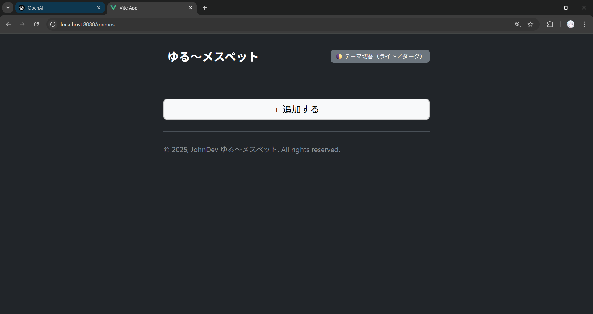

# 📑 MFE 第1段階 統合作業記録
# 2025年 9月 1日
本ドキュメントは、メインプロジェクト **`yuruArchive`**（Spring Boot + Gradle）に、  
フロントエンドモジュール **`yuru_messpad`**（Vue3 + Vite）を  
**Micro Frontend (MFE)** 方式で統合した手順を記録したものです。  

---

## ✅ 作業手順

### 1. フロントエンドプロジェクトの準備
- `yuru_messpad` フォルダをメインプロジェクトルート（`yuruArchive/`）に配置。
- `package.json` に以下のスクリプトが存在することを確認:
  ```
  {
    "scripts": {
      "dev": "vite",
      "build": "vite build",
      "preview": "vite preview"
    }
  }
　```

### 2. Vite 設定の修正
`vite.config.ts` に base: '/memo/' を追加。

```
export default defineConfig({
  base: '/memo/',
  plugins: [vue()],
  resolve: {
    alias: { '@': fileURLToPath(new URL('./src', import.meta.url)) }
  },
  server: {
    host: true,
    port: 5173,
    strictPort: true
  }
})
```
### 3. 依存関係の解決
Vite 7 と plugin-vue 5 の非互換を解消するため、Vite を 6 系にダウングレード。

```
cd ゆる~メスペット
rm -rf node_modules package-lock.json
npm install -D vite@^6 @vitejs/plugin-vue@^5.2.4
npm install
```

### 4. フロントエンドのビルド

```
cd ゆる~メスペット
npm run build
正常終了すると dist/ フォルダが生成される。
```

### 5. ビルド成果物をメインプロジェクトに反映

```
cd ..
mkdir -p src/main/resources/static/memo
cp -r ゆる~メスペット/dist/* src/main/resources/static/memo/
```

### 6. バックエンドの起動
```
Gradle ベースのため以下のコマンドで実行:
./gradlew bootRun       # Linux/Mac/Git Bash
.\gradlew.bat bootRun   # Windows CMD/PowerShell
```

### 7. 動作確認
```
ブラウザで以下の URL にアクセス:
http://localhost:8080/memo/index.html
http://localhost:8080/memo
```


開発者ツールの Network タブで /memo/assets/... が 200 OK で返ることを確認。


### 🎉 第1段階 完了
Vue3 + Vite ベースの **yuru_messpad** アプリを、メインプロジェクト **yuruArchive** に **MFE 方式**で統合することに成功。

- iframe を使用せず、`/memo` パスで **正常に動作**することを確認
- **メモの CRUD 機能** が正常に動作
- **ライト/ダークモードの切り替え** が正常に動作

現時点では手動コピーでの反映だが、次の段階では **自動化（Gradle フック / CI/CD パイプライン）** および **MFE モジュール拡張** を目指す。

## License
This project is **NOT open source**.  
All rights reserved by © 2025~2026 John Dev.  
Commercial use is strictly prohibited unless prior written permission is obtained.