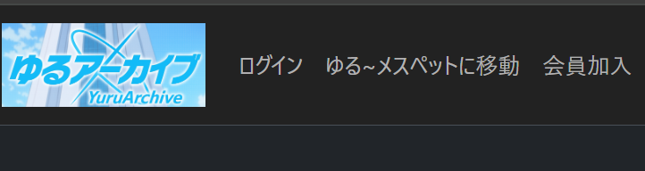
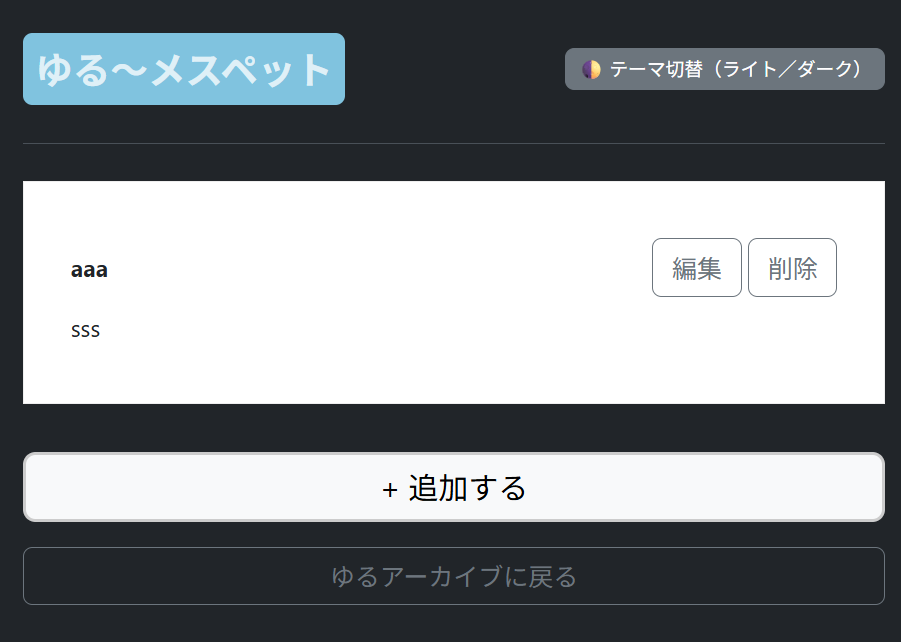

# 📑 MFE 第1段階追加 統合作業記録
# 2025年 9月 17日
本ドキュメントは、メインプロジェクト **`yuruArchive`**（Spring Boot + Gradle）に、  
フロントエンドモジュール **`yuru_messpad`**（Vue3 + Vite）を  
**Micro Frontend (MFE)** 方式で統合した手順を記録したものです。  

---

## 🏗 開発環境
- **バックエンド**: Spring Boot 3.x, Gradle, Java 17  
- **フロントエンド**: Vue3, TypeScript, Vite, Bootstrap 5.3, SCSS  
- **DB**: PostgreSQL  
- **IDE/ツール**: Eclipse, VS Code, GitHub  

---

## 🔧 開発フロー

### 1. フロントエンド (yuru_messpad)
- 開発モード:
  ```
  cd yuru_messpad
  npm run dev
  ```

- http://localhost:5173/ にて Vue 単体の HMR 確認
- .vue, .ts, .scss の修正が即座に反映される
- ビルド: npm run build
- 出力先: yuru_messpad/dist/

### 2. バックエンド (yuruArchive) への統合
- ビルド成果物をコピー : yuru_messpad/dist/ → yuru-archive/src/main/resources/static/memo/
- Spring Boot サーバ起動 : ./gradlew bootRun
- 動作確認 : http://localhost:8080/memos/
 メインアプリ連携: http://localhost:8080/question/list


### ✅ 確認事項
- /memos/ にアクセス → SPA (Vue Router) 正常表示
- /memos/add など SPA 内ルーティングも fallback → index.html に正しく処理
- 「メインに戻る」ボタン → /question/list に遷移
- ビルド成果物が欠損している場合は 500 エラーになるため、dist/ コピーの完全性を必ず確認

### ✅ 完了イメージ
- ゆるアーカイブ画面(ゆる~メスペットへ移動ボタン)
 
- ゆる~メスペット画面(ゆるアーカイブへ移動ボタン)
 

### 📂 今後のタスク
- MFE 第2段階: 自動デプロイスクリプト導入
- CI/CD (GitHub Actions) によるビルド＆配布自動化
- デザイン調整 & ユーザー体験改善

## License
This project is **NOT open source**.  
All rights reserved by © 2025 John Dev.  
Commercial use is strictly prohibited unless prior written permission is obtained.