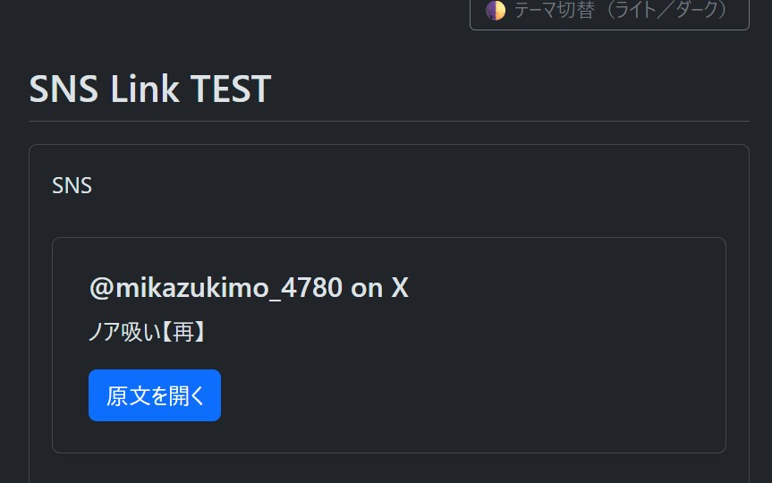
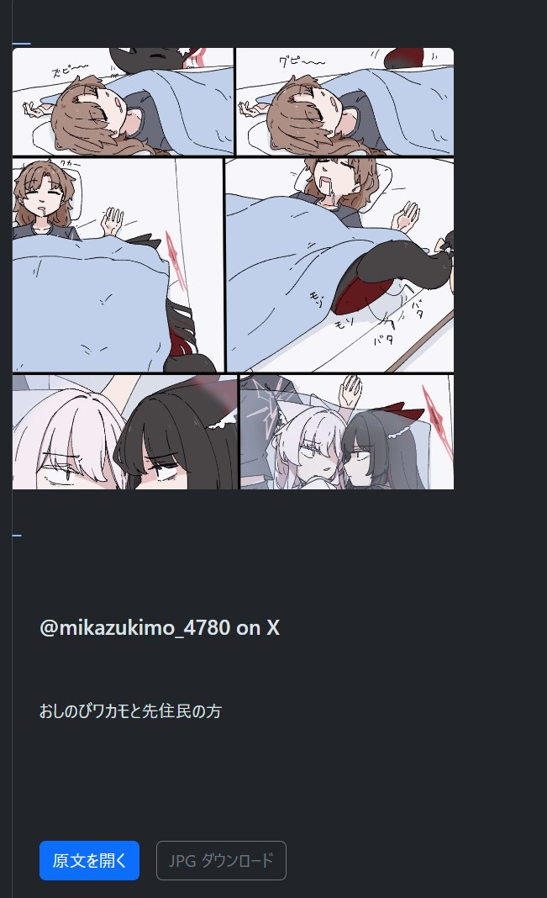

## 20251110 各種SNSのリンクプリビュー機能追加（開発中です。）
Microlink + Cloudinary + medium-zoom + Autolinker + セキュリティ対策を含み開発をしておりました。

**Develop Environment**  
- Java 17(after Upgrade for Java 21)  
- Spring Boot 3.5.x  
- Thymeleaf 3.x  
- Bootstrap 5.3.2  
- Microlink / Cloudinary API  


 **※ 開発の流れ**
 
 1. Webflux, caffeineを使って、キャッシュを柔軟に対応できるようにしました。
 2. OGP外部呼び出し+ セキュリティの検証 + Cloudinary JPGを強制的に変換する。
 3. コントローラーは、DB無しにURLのみを受信し、カード方式にレンダリングします。
 4. thymeleaf templateを作ります。 
 5. Global Security Header(CSP etc..)
  
📝 **補足内容**：
 	<dl>
		<dd> 1. Spring Security無しに簡単にフィルター適応もできるし、Securityを使っているなら、SecurityFilterChainからヘッダーを指定しても構わない。</dd>
		<dd> 2. 必要なドメインだけを開けておくことが原則であり、unpkgやjsDelivrを使わずに、自体的にホスティングをすれば、CSPをもっときつく減らせることが可能。</dd>
		<dd> 3. bootstrap + イメージ拡大機能 + 自動的にリンク化する</dd> 
	</dl>
📝 **期待できるところや使う方法**：

	ページへ移動:
	→ GET /cards/preview?url=https://example.org/some-article
	→ Microlinkが メタデータを受信し、イメージは Cloudinary fetch + f_jpgに JPG拡張子を固定します。	
	→ イメージをクリックしたら拡大されており, 説明の中で、URL/@handleは、自動的にリンク化されて、 “原文を開く”機能は、新しいタップで開かれます。

🕵️‍♀️ **  セキュリティ/devops Check Point **
	<dl>
		<dd> 1. Microlink 呼び出しはサバー側のみ(Key/quarter Security), 応答フィルダー長さ制限及びnullのロールバック</dd>
		<dd> 2. Cloudinary fetch domain allowlist設定をお勧め(アカウントセキュリティ設定) + 必要な時にはサインする形のURL.</dd>
		<dd> 3. network Timeout(5second), result**TTLcache(10minute)**で、コストとディレイを緩和できます。</dd>
		<dd> 4. テキストは、基本的にescape, Autolinkerに sanitizeHtml: trueと危険なスキームを遮ることできます。</dd>
		<dd> 5. CSP/Referrer/nosniff/HSTS(production)Applyed.</dd>
	</dl>

## 20251128 各種SNSのリンクプリビュー機能追加（開発完了です。）
 - 開発期間 : 総18日

## 📘 リンクカード機能の実装記録（開発ログ）

## 🚀 概要
本プロジェクトでは、**質問投稿内の URL を自動解析し、OGP(Open Graph Protocol) を基に「リンクカード」を生成する機能**を実装しました。  
Markdown の表現力を損なわず、ユーザー体験を向上させることを目的としています。

本機能により、以下のような記述が可能になります：

``[[linkcard url="https://example.com"]]``
 

---

## 🧩 機能仕様

### ✔ 1. OGP メタデータの取得
- 指定 URL へサーバー側からアクセスし、以下の OGP 情報を解析  
  - `og:title`  
  - `og:description`  
  - `og:image`  
  - `og:url`  

取得したデータは `OgMetadata` としてコントローラに渡されます。

---

### ✔ 2. テンプレートレンダリング
- `card.html` にてリンクカード用テンプレートを作成  
- `Thymeleaf TemplateEngine` を用いて HTML として描画  
- **DB の question.content はそのまま保持し、画面描画時のみリンクカードを反映**  
　（Markdown と干渉しない安全な構造設計）

---

### ✔ 3. フォールバック処理（Graceful Degradation）

外部サーバーが画像リンクをブロックしたり、CORS、404 を返すケースに備え、  
以下のフェイルセーフ処理を実装：

- 画像取得エラー → `` タグを自動削除する  
- ダウンロードボタンも同時に非表示  
- タイトル / 説明 / URL は正常表示  
- UI の崩壊を完全防止

---

## 🎨 UI / レイアウト改善

### ✔ カード本体スタイル
```
<div th:fragment="linkCard(og)"
     class="card shadow link-card"
     style="width:100%; max-width:min(1060px, 90vw); margin-top:1.6rem; margin-bottom:1.4rem;">
```
 - PC・モバイル両対応
 - 最大幅を柔軟に調整（min(1060px, 90vw)）
 - 適切な余白で読みやすさ向上

## ✔ 画像処理
```

```
 - 画像取得エラー時は 即時削除
 - CORS でも崩れないカード構成

## 🧪 question_detail.html への統合
リンクカードが存在する場合は htmlBody を優先的に描画：

```<!-- リンクカードを優先表示 -->
<div th:if="${htmlBody != null}"
     th:utext="${htmlBody}">
</div>

<!-- 無ければ通常の Markdown 出力 -->
<div th:if="${htmlBody == null}"
     th:utext="${@commonUtil.markdown(question.content)}">
</div>
```
Markdown の二重描画を防ぐため、旧ロジックは整理済み。

## ✔ 開発済みの画面

- 画像を提供するサーバー側で **404 エラー** が発生した場合、  
  プレビュー画像の `` タグを削除し、**ダウンロードボタンも自動的に非表示** にします。
- 404 エラーが発生しなければ、プレビュー画像を表示し、  
  あわせて **JPG ダウンロードボタンも有効** な状態で表示されます。
 
## 🔄 バックアッププロジェクトについて（補足）
リンクカード開発中の破損リスクに備え、
バックアッププロジェクト側にも同等のリンクカード処理を実装済みです。

含まれている実装：
 - OGP 解析ロジック
 - TemplateEngine レンダリング
 - card.html のリンクカード fragment
 - question_detail 相当の統合ロジック（htmlBody 優先描画）

#🔹 万が一メインプロジェクトに不具合が発生した場合は、バックアップ側のコードを参考実装として利用できます。

# 🏁 完成度と総評
今回のリンクカード実装は、UI / 安定性 / データ整合性 を高レベルで満たした完成度の高い仕上がりになりました。

# 📌 達成したポイント
✔ URL → OGP → リンクカード自動生成

✔ Markdown を壊さない安全な仕組み

✔ 外部ホストの画像エラーに強い堅牢設計

✔ PC / モバイル両方で自然なレイアウト

✔ バックアッププロジェクトにも実装済み（参照性◎）

# 今後は、キャッシュ化・複数 URL 対応などへ発展できます。

## 🔧 20251201 各種SNSのリンクプリビュー機能 UI/UX polishing 作業完了
UI/UX Polishing 作業完了のお知らせ

本日、リンクカード（SNSリンクプレビュー）機能における
UI/UX の最終調整（Polishing）作業が完了しました。

今回のアップデートでは、機能面の安定化だけでなく、利用者目線での視認性・操作性を重点的に改善しています。

## ✅ 主な改善内容
### 1. プレビュー画像の安定表示
 - これまで Cloudinary 経由の変換が原因で 404 が多発していた問題を解消
 - 画像 URL をそのまま利用する方式へ変更
 - onerror 処理により、破損画像の自動隠蔽が実現
 - レイアウト崩れも完全に防止

### 2. 画像と本文コンテンツのレイアウト最適化
 -  object-fit: cover により過度な伸び・歪みを防止
 - PC とモバイルのどちらでも美しく表示されるよう、最大幅・余白・高さのバランスを再調整
 - 画像未取得時は要素ごと非表示にし、空白を残さない仕様に変更

### 3. アクションボタンの整列・デザイン改善
 - 「原文を開く」「JPG ダウンロード」ボタンを横並びに統一
 - 非表示条件 (og.image != null) を厳密化し、見た目の一貫性と操作性向上を両立

### 4. カード全体のマージン・幅・影（shadow）の再調整
 - max-width: min(1060px, 90vw) によって PC では広く、スマホでは自然な幅になるようレスポンシブ化
 - 上下の余白を適度に取り、本文や他要素との距離感を改善
 - カードデザインをよりシンプルかつ読みやすく調整

## 🔧 技術的安定性の向上
- 外部 API 依存を排除し、純粋な OG タグ読み取りベースの安定構成へ移行
- コントローラー側も最小限の修正で安全に統合
- エラー時 fallback 処理を強化し、表示崩れ・例外発生を防止
- card.html を中心にテンプレート構造を整理し、拡張にも対応しやすい構成に改善


## ✔ UI/UXポリシング済みの画面


## 🎉 まとめ
今回の polishing により、実運用レベルで安定したリンクカード機能へと仕上がりました。

長文投稿、Twitter / X、ブログ、外部ニュースなど、幅広い URL を美しくプレビューできるようになり、プロジェクト全体の品質向上にもつながっています。

今後の新機能追加（メトリクス表示 / 動的 API 対応など）にも柔軟に対応できる構成になっています。


## 緊急対応[20251204]
# 🚧 機能一時停止のお知らせ（リンクカード・プレビュー機能）

現在、本プロジェクトで提供している SNSリンクカードのプレビュー機能 について、
外部サービス（特に X/Twitter）の仕様変更・画像取得制限 により、
以下の挙動が安定して行えなくなっております。

#❗ 影響範囲
 ● プレビュー画像の取得
 
一部 SNS（例：X/Twitter）より OG:image が返されない / 403 / 404 が発生するため、
プレビュー画像の表示が不安定、または完全に取得不可となっています。

 ● JPG ダウンロードボタン
 
画像URLが無効となるケースが増えたため、
誤ったリンク遷移（404 ページ）を誘発するリスク回避のため、一時的に機能を停止しています。

 ● description（説明文）および thumbnail
 
API / ポリシー変更により取得が制限され、
内容が空もしくは不正形式で返ってくるケースが確認されています。

# 🛠 対応状況
本アプリ側の実装には問題はなく、
外部SNS側の仕様変更による不可抗力の障害であることを確認済みです。

そのため、以下のように安全性と UX を優先した暫定措置を行いました。
✔ 画像プレビュー機能 → 一時的に停止
✔ JPG ダウンロードボタン → 一時的に非表示
✔ 原文リンク（URL へ遷移）は正常稼働のためそのまま維持
✔ カードデザインは崩れないよう最適化した状態を維持

これにより、ユーザーが誤ったリンクへ飛ばされる事を防ぎ、
表示の破損による UX 劣化も回避しています。

# 🔍 今後の予定
外部サービス側（X/Twitter など）の API・ポリシーが安定し、
OG データの取得が再び可能になった段階で、本来のリッチプレビュー機能を復旧 する予定です。

復旧確認後は、カード画像・説明文・ダウンロードボタンを 即座に再活性化 できるようコードは保持済みです。

# 📝 補足
現在停止しているのは「画像・説明文・ダウンロード」機能のみです
投稿データ（question.content）は一切変化していません
表示の安定性向上を目的とした措置であり、アプリの他機能には影響ありません
他の一般 Web サイト・ブログ等からの OG 取得は従来どおり正常動作します

# 🙏 ユーザー・開発者の皆様へ
ご不便をおかけしますが、
本対応は アプリの安全性・ユーザー体験を守るための暫定措置 です。

外部サービスの仕様が安定次第、
プレビュー機能は速やかに復旧いたしますので、
引き続きご利用・ご協力のほどよろしくお願い申し上げます。
 
 
## License
This project is **NOT open source**.  
All rights reserved by © 2025 John Dev.  
Commercial use is strictly prohibited unless prior written permission is obtained.