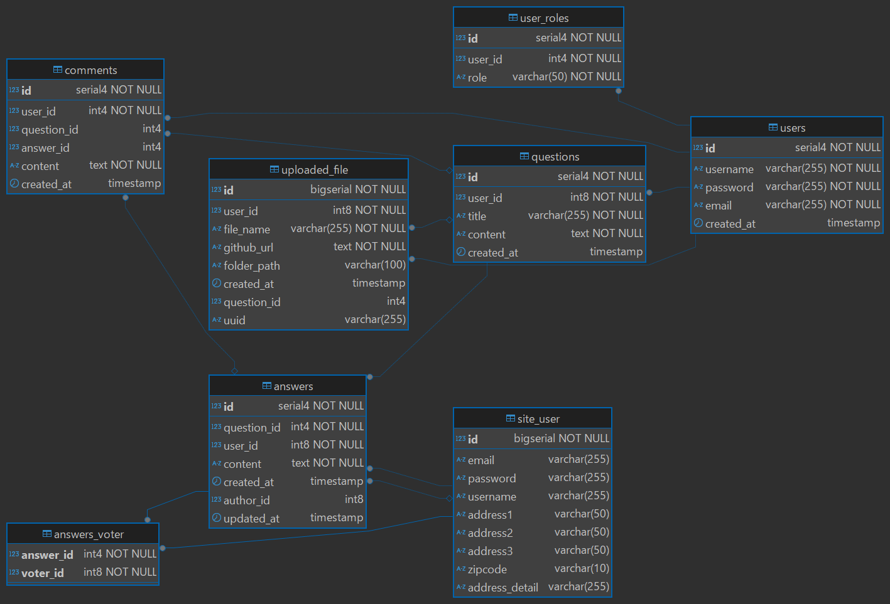

## 🗃️ データベース設計

### ER図（最新版）

### テーブル定義（SQL）
📎 [ゆるアーカイブQuery.sql](https://raw.githubusercontent.com/john911120/yuru-archive/main/sql/ゆるアーカイブQuery.sql)

📌 変更履歴 (20250512) 
✅ answers テーブルの拡張 
<li> author_id カラムを追加（回答者のユーザー情報を保持）</li>
<li> updated_at カラムを追加（編集日時の追跡）</li>

✅ 投票機能の実装 
<li> answers_voter 中間テーブルを新規作成 </li>

sql
CREATE TABLE answers_voter (
    answer_id BIGINT NOT NULL, -- 回答ID（外部キー、answersテーブルを参照）
    voter_id BIGINT NOT NULL,  -- 投票ユーザーID（外部キー、site_userテーブルを参照）
    PRIMARY KEY (answer_id, voter_id), -- 複合主キー（重複投票を防ぐ）
    FOREIGN KEY (answer_id) REFERENCES answers(id) ON DELETE CASCADE,
    FOREIGN KEY (voter_id) REFERENCES site_user(id) ON DELETE CASCADE
);

✅ バグ修正・Thymeleafの調整
question_detail.html での answer.voter アクセスエラーを修正（getter追加）

#lists.size() の変換問題を answer.voter.size() に修正

✅ ERDとSQL定義の更新 
<li> ER図に answers_voter テーブルを反映 </li>
<li> DB初期化用SQLスクリプトに新テーブルとカラムを追加 </li>

🪪 DB変更履歴と設計反省
実装履歴
answers テーブル：author_id, updated_at カラム追加
answers_voter テーブル新設（複合PK + 外部キー）
question_detail.html における .voter.size() 呼び出し修正
ERDおよび初期化SQLスクリプトを更新

開発上の反省点
最初にDB構造を確定せず開発を進めたことで、後から修正が必要になった
今後は事前にテーブル定義を決めてからロジック実装へ入ることを徹底する

## 20250604 Database Column 更新します。
 uploaded_file テーブルにあるgithub_url コラムは使わないので、削除し、ERDを更新しました。
 
## 20250616 Database Column 更新しました。
    alter table if exists uploaded_file 
       add column uuid varchar(255)；
       
## 20250617 ERD_Diagram イマージを更新しました。    

## License

This project is **NOT open source**.  
All rights reserved by © 2025 John Dev.  
Commercial use is strictly prohibited unless prior written permission is obtained.
