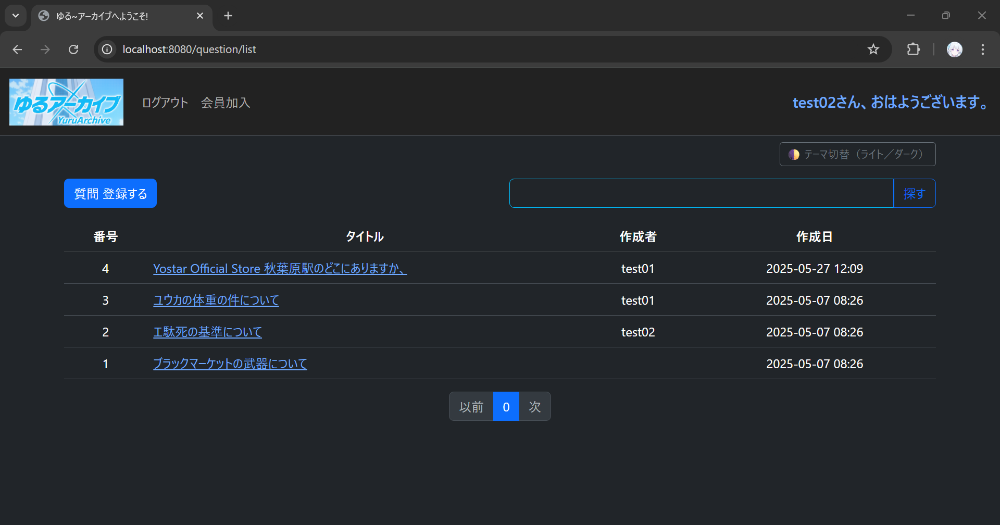
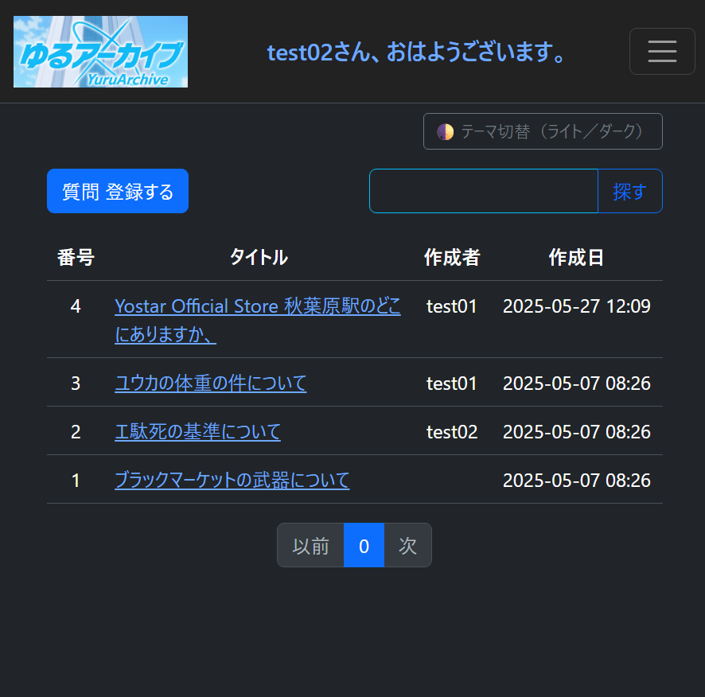

## 250529 🌐 グローバルModel属性の自動設定（挨拶＋ユーザー名）
ログインユーザー向けに時間帯に応じた挨拶メッセージとユーザー名をすべての画面上部に表示する機能を実装しています。

#### ✅ 概要

- `@ControllerAdvice` を利用し、全コントローラー共通で `Model` に以下の属性を追加しています：
  - `username`（ログインユーザー名）
  - `greeting`（時間帯に応じた挨拶）

- 表示例：
test02さん、おはようございます。
test02さん、こんにちは！
test02さん、こんばんは！

#### 🔧 技術構成
<table>
  <thead>
    <tr>
      <th>項目</th>
      <th>内容</th>
    </tr>
  </thead>
  <tbody>
    <tr>
      <td>クラス名</td>
      <td><code>GlobalModelAttributeAdvice.java</code></td>
    </tr>
    <tr>
      <td>対象アノテーション</td>
      <td><code>@ControllerAdvice</code>, <code>@ModelAttribute</code></td>
    </tr>
    <tr>
      <td>ユーティリティ</td>
      <td>
        <code>GreetingUtil.java</code>：<br>
        <code>LocalTime</code> を基に挨拶文（<strong>おはよう・こんにちは・こんばんは</strong>）を返す静的メソッド
      </td>
    </tr>
    <tr>
      <td>表示箇所</td>
      <td><code>navbar.html</code> 内部の共通ヘッダー領域</td>
    </tr>
  </tbody>
</table>


#### 📱 レスポンシブ対応

スマートフォンなどの小画面では、横幅を考慮し以下のように調整しています：

```html
<span class="d-none d-sm-inline" th:text="${username} + 'さん、' + ${greeting}"></span>
<span class="d-inline d-sm-none" th:text="${username} + 'さん、' + ${greeting}"></span>
```

🎨 ダークモード対応
text-primary-emphasis を使用することで、Bootstrap 5.3+ におけるダーク／ライトモードの切り替えに対応しています。
 
 <div class="fw-bold fs-5 text-primary-emphasis" th:if="${username}">
  <!-- 上記のspanがここに含まれます -->
</div>

🖼️ 表示イメージ（PCとモバイル）
#### 🖼️ 表示イメージ（PCとモバイル）
## 🖥️（デスクトップ）


## 📱（フレキシブル／レスポンシブ対応）



💬 備考
ログインしていない状態では、挨拶メッセージは表示されません。
principal が null の場合のログも System.out.println() にて開発中は出力されます。

✅ 補足説明

Bootstrap 5.3 で新たに導入された
text-primary-emphasis、text-body、text-body-secondary などの
テーマ連動型クラス（ライト／ダークモード対応） を使用

<body data-bs-theme="light"> または "dark" を設定することで
文字色や背景色が自動で切り替わる設計を実現

JavaScript や手動の CSS 設定なしでも一貫した配色が可能

実際に text-primary-emphasis をログインメッセージなどに使用し、
コードの簡素化と UX 向上に貢献

最近になってこの機能を知ったが、導入してみると非常に便利で、
全体のレイアウト品質を高める要因となった。


## License

This project is **NOT open source**.  
All rights reserved by © 2025 John Dev.  
Commercial use is strictly prohibited unless prior written permission is obtained.