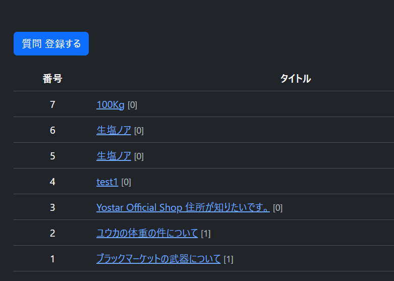
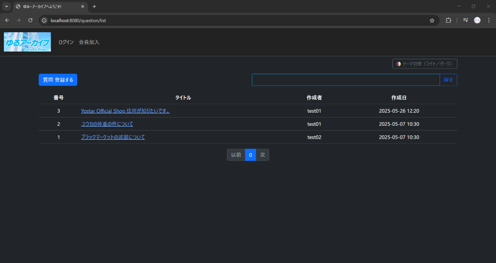
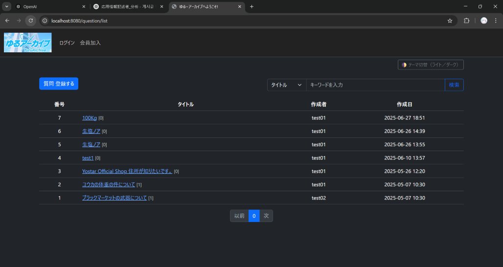

## 📡 外部API

- 使用API：日本住所検索API（郵便番号API）
- 利用目的：ユーザー登録時の住所補完機能


🔧 Spring Boot 3.2.12へマイナーアップデート (250627)
- DoS対策（CVE-2024-22262等）を含む安定版
- 依存関係の安全性向上のため、3.2.1 → 3.2.12に更新
- build.gradleのpluginバージョンを修正


## 🇯🇵 DevOps記録（コメント数表示機能の追加)
📅 日付: 2025年7月3日（木）


🖼 実際の画面: <br>


🛠 作業内容:
- 投稿一覧画面に「コメント数（回答数）」を表示する機能を追加（Plan A方式）
- AnswerRepository に `countByQuestion` メソッドを追加
- QuestionController で質問ごとのコメント数をカウントし、Map形式でテンプレートへ渡すように修正
- question_list.html にコメント数表示を追加
- Thymeleaf上での SpELエラー（null参照）を回避するため、nullチェック条件を追加

🕒 作業時間:
- 想定: 約2時間  
- 実績: 約40分（前日に処理方針を事前に設計したため、スムーズに対応）

🐛 発生した問題と対応:
- テンプレート側で `answerCountMap[question.id]` に null が渡されたことにより、SpELパースエラーが発生
- 原因をログから特定し、Controllerで `model.addAttribute()` が不足していたことを確認
- nullチェック付きの条件式で安全に回避完了

📌 今後の対応検討:
- 質問数が多くなった場合、JPQL＋DTOによるPlan B（最適化構成）への移行も視野に入れる
- 上部固定の「お知らせ投稿」機能の追加要望に備えた設計も検討中

##🛠️【2025年7月9日】質問リスト画面の改善 & 検索機能の調整
✅ 機能追加
タイトル／作成者による 条件付き検索 を実装
ページネーションと検索条件の 連携処理 に対応
Controller → Service → Repository の構成に従って処理を整理

🎨 UI 改善
input-group レイアウトを Bootstrap基準で再設計
モバイル環境：w-100 による 横幅最大表示対応
デスクトップ環境：最大幅 (max-width: 600px) に制限して空白解消
キーワード入力欄の 幅を制限 (max-width: 500px) し、バランス良く表示

🧩 トラブル対応
flex-grow, w-100 などの組み合わせによる UI 崩れを修正
レスポンシブ環境でのレイアウト崩れを container 配置と min-width` 調整で回避


🖼 AS-ISの画面(質問リスト画面の改善前): <br>


🖼 TO-BEの画面(質問リスト画面の改善後): <br>


## 📌 2025年 7月 10日 実装された機能一覧（第1フェーズ）
✅ ファイル添付機能（画像）
複数の画像ファイルを質問投稿時に添付可能
対応拡張子：.jpg, .jpeg, .png, .gif, .webp
拡張子フィルターはクライアント側（accept属性）およびサーバー側でバリデーション実施
ファイルはアップロード時に日付ごとのフォルダへ自動保存される
例：/upload/2025-07-10/uuid_ファイル名

✅ ファイルの削除機能
質問編集時に添付ファイルの個別削除が可能
ファイル本体とDB上の情報の両方を削除

✅ ファイルのダウンロード機能
質問詳細ページで添付されたファイル一覧を表示
ファイル名クリックでダウンロード可能（Content-Disposition対応）

✅ 認証・認可
質問投稿・編集・削除などはログインユーザーのみ許可（@PreAuthorize使用）
未認証アクセス時にはログインページへリダイレクト

✅ UI連携
Bootstrap + Thymeleafにて、ユーザーが直感的に操作できるUIを構築

<<<<<<< HEAD
※ 第2フェーズとして、他の端末でのテストを実施し、確認結果をREADMEに追記する予定です。
=======
※ 第2フェーズとして、他の端末でのテストを実施し、確認結果をREADMEに追記する予定です。[当日17:00から18:00までのテスト]
1. コードの反映に問題なし（異なる端末での動作確認済み）
2. 未ログイン状態で投稿しようとすると、ログインページにリダイレクトされるように設定済み
 - 元々、未ログインユーザーには投稿の閲覧制限は想定していなかった
3. .webp / .gif / .jpg ファイルのアップロードに問題なし（DBに正常に反映されることを確認）
 - ダウンロード機能も正常に動作（ダウンロードした全ファイルに破損なし）
 - 投稿詳細ページで .gif の動作も確認済み
 - 投稿編集・添付ファイル削除機能も正常に動作
  - .webp 削除・編集：DB上でも削除されたことを確認
  - .gif 削除・編集：DB上でも削除されたことを確認

## 今後の展望
🔚 今後の展望とご挨拶
7月10日をもちまして、追加開発の作業はすべて終了いたしました。

これにより、開発フェーズは一区切りとなり、今後2週間ほどは、
韓国における情報処理技術者試験（二次試験）の準備のため、お休みをいただきます。

試験終了後は、クラウド環境（DockerやAWS）への実装・展開を目指して、
引き続き作業を進めてまいりますので、何卒ご理解のほどよろしくお願いいたします。

ここまでの成果物を形にできたのは、見守ってくださった皆様のおかげです。
心より感謝申し上げます。皆様のお力添えがあり、成長することができました。
今後ともどうぞよろしくお願いいたします。

本当にありがとうございました。
<(_ _)>

## 📌 2025年 7月 28日 Thymeleaf SecurityCode Check
>>>>>>> 1d236a3 (✅ 対策内容: JSoup + Commonmark による Markdown XSSフィルタリング)

### ✅ 対策内容: JSoup + Commonmark による Markdown XSSフィルタリング

このプロジェクトでは、`th:utext`を用いたMarkdownレンダリングにおいて  
外部からのスクリプト挿入（XSS）を遮断するために、以下の対応を行いました。

### 🔧 適用技術
- [`commonmark-java`](https://github.com/commonmark/commonmark-java) による Markdown → HTML変換
- [`jsoup`](https://jsoup.org/) による HTML サニタイズ（`Safelist.basicWithImages()`）

### 🔒 適用目的
- ユーザーが投稿した Markdown テキストを安全に HTML 表示すること
- HTMLタグのうち、見出し・リンク・画像など基本的な要素のみを許可
- `<script>`, `onerror`, `iframe`, `style` などの危険な要素は完全除去

### 📄 対象箇所
- `question_detail.html` および `answer.content` を表示する箇所の `th:utext` に適用
- Java側では `CommonUtil.java` 内の `markdown()` メソッドを通じてフィルタリング処理を統一

### 📁 該当クラス
```java
@Component
public class CommonUtil {
    public String markdown(String markdownText) {
        ...
        return Jsoup.clean(html, Safelist.basicWithImages());
    }
}

🧪 確認方法
以下のようなマークダウンを投稿し、意図した HTML だけが表示されているかを確認：

# タイトル
<script>alert('XSS')</script>
[リンク](https://example.com)

→ 結果: script や onerror は削除され、リンクと見出しのみが安全に表示される

📌 注意事項
JSoupの Safelist 設定は必要に応じて拡張可能です。
MarkdownエディタやWYSIWYG導入時にもこの処理を通す必要があります。

## License
This project is **NOT open source**.  
All rights reserved by © 2025 John Dev.  
Commercial use is strictly prohibited unless prior written permission is obtained.