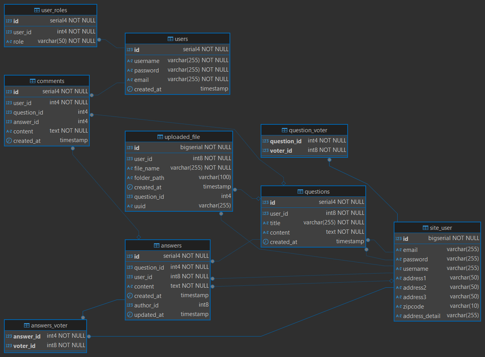

# DevOps Upgrade Log (2025-10-22)
このドキュメントは、開発環境およびローカル環境における
Spring Boot / PostgreSQL アップグレード内容を記録します。

---

## 🔧 対応内容
| 分類 | 対象 | 概要 |
|------|------|------|
| Framework | Spring Boot | 3.2.12 → 3.5.6 （3.2.xバージョンEOL対策適用版） |
| Java | JDK | 17 → 21 (準備段階) |
| DB | PostgreSQL | 外部キー制約とインデックス再構成 |
| Thymeleaf | Thymeleaf | 検索処理修正 (page=0 reset fix) |

### 🔍 アップグレード理由
長期サポート(LTS)環境を維持し、依存関係の安定化および将来のSpring Boot 4.x移行を見据えた基盤整備のためアップグレードしました。

---

## 🗃️ DB Migration
ERD 更新版:  

関連SQL:  
[`ゆるアーカイブ_FK&Index.sql`](../sql/ゆるアーカイブ_FK&Index.sql)  
---

## 🧩 検証結果
- 質問投稿／編集／削除 ✅  
- 添付ファイル登録／削除 ✅  
- ダークモード切替 ✅  
- MFE (Vue3) モジュール連携 ✅  
- PostgreSQL ログ: ConstraintViolation 修正確認済み  

---

## ⚠️ 注意点
- JDK 21 環境への正式移行は 2025-11 以降を予定  
- Flyway/Liquibase への移行検討 (2026-Q1)  
- ERD出力は DBeaver Community版ではインデックス非表示のため pgAdminで補足

---

## 🧾 変更理由
Spring Boot 4.0 への移行準備段階として、  
3.5.x 系安定版に統一し、DB構造整合性と性能改善を目的とする。

## License
This project is **NOT open source**.  
All rights reserved by © 2025 John Dev.  
Commercial use is strictly prohibited unless prior written permission is obtained.